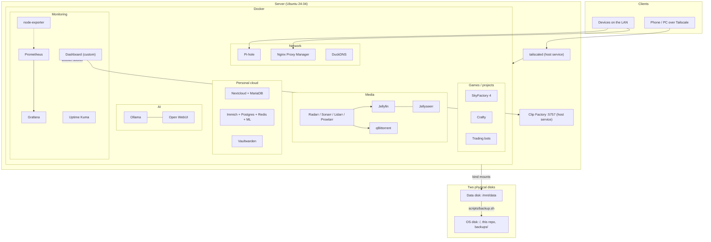

# Homelab

Configuration, custom code and documentation for my home server: a Dell
Latitude 5521 (i7-11800H, 32 GB RAM) running Ubuntu 24.04 and about 30 Docker
containers, with a second NVMe disk for data.

Everything that can be described as text lives here. Data, secrets and media do
not; see [What is not in this repo](#what-is-not-in-this-repo).

## Contents

- [What it does](#what-it-does)
- [Architecture](#architecture)
- [Services](#services)
- [Repository layout](#repository-layout)
- [Quick start](#quick-start)
- [Day-to-day commands](#day-to-day-commands)
- [Backups and restore](#backups-and-restore)
- [Security notes](#security-notes)
- [Known issues and to-do](#known-issues-and-to-do)
- [Conventions](#conventions)
- [What is not in this repo](#what-is-not-in-this-repo)

## What it does

| Area | What the server provides |
|---|---|
| **Media** | Streams movies, TV and music; automates finding, downloading and organising them |
| **Personal cloud** | File sync (Nextcloud), photo library (Immich), password manager (Vaultwarden) |
| **Network** | Network-wide ad blocking and DNS (Pi-hole), reverse proxy with certificates, remote access over Tailscale, dynamic DNS |
| **AI** | Local language models (Ollama) with a chat interface (Open WebUI) |
| **Games** | A modded Minecraft server and a Minecraft server manager |
| **Monitoring** | Metrics, dashboards, uptime checks and a custom status dashboard |
| **Projects** | Two trading bots (paper trading by default) and a video clip generator |

## Architecture



Two disks are deliberate: all container data lives on the **data disk**
(`/mnt/data`), while the OS, this repo and the **backups** are on the other disk.

## Services

Each service has its own page under [`docs/services/`](docs/services/README.md).

| Service | Purpose | Port | Status |
|---|---|---|---|
| [Dashboard](docs/services/dashboard.md) | Custom status and control page | 4000 | Running |
| [Portainer](docs/services/portainer.md) | Docker management UI | 9000 / 9443 | Running |
| [Pi-hole](docs/services/pihole.md) | DNS and ad blocking | 8080 (UI), 53 | Running |
| [Nginx Proxy Manager](docs/services/nginx-proxy-manager.md) | Reverse proxy, certificates | 81 (UI), 80, 443 | Running |
| [Tailscale](docs/services/tailscale.md) | Remote access VPN (host service) | host | Running |
| [DuckDNS](docs/services/duckdns.md) | Dynamic DNS updater | none | Running |
| [Jellyfin](docs/services/jellyfin.md) | Movie and TV streaming | 8096 | Running |
| [Jellyseerr](docs/services/jellyseerr.md) | Media requests | 5055 | Running |
| [Radarr](docs/services/radarr.md) / [Sonarr](docs/services/sonarr.md) | Movie and TV automation | 7878 / 8989 | Running |
| [Lidarr](docs/services/lidarr.md) / [Navidrome](docs/services/navidrome.md) | Music automation / streaming | 8686 / 4533 | **Stopped** |
| [Prowlarr](docs/services/prowlarr.md) | Indexer manager | 9696 | Running |
| [qBittorrent](docs/services/qbittorrent.md) | Torrent client | 8082 | Running |
| [Nextcloud](docs/services/nextcloud.md) | Files | 8081 | Running |
| [Immich](docs/services/immich.md) | Photos | 2283 | Running |
| [Vaultwarden](docs/services/vaultwarden.md) | Passwords | 8443 | Running |
| [Ollama](docs/services/ollama.md) | Local LLMs | 11434 | Running |
| [Open WebUI](docs/services/open-webui.md) | Chat UI for Ollama | 3000 | Running |
| [Prometheus](docs/services/prometheus.md) | Metrics store | 9090 | Running, target down |
| [node-exporter](docs/services/node-exporter.md) | Host metrics | 9100 | Running |
| [Grafana](docs/services/grafana.md) | Dashboards | 3002 | Running, unconfigured |
| [Uptime Kuma](docs/services/uptime-kuma.md) | Uptime checks | 3001 | Running |
| [Crafty](docs/services/crafty.md) | Minecraft server manager | 8444 | Running |
| [SkyFactory 4](docs/services/skyfactory4.md) | Modded Minecraft server | 25601 | Running |
| [Polymarket bot](docs/services/polymarket-bot.md) | LLM trading bot | none | **Stopped** |
| [Trading bot](docs/services/tradingbot.md) | Paper-trading bot | none | Running |
| [Clip Factory](docs/services/clip-factory.md) | Video clips (host service, **not in this repo**) | 5757 | Running |

## Repository layout

```
.
├── docker-compose.yml       main stack: media, cloud, network, AI, monitoring
├── .env.example             template for the secrets the main stack needs
├── homeserver.service       reference systemd unit (NOT installed; see docs/host-setup.md)
├── dashboard/               custom dashboard: Node/Express server + React client
├── prometheus/              Prometheus scrape configuration
├── bots/                    trading bot and Polymarket bot: source and compose file
├── services/
│   ├── duckdns/             dynamic DNS updater (own compose project + .env.example)
│   └── skyfactory4/         Minecraft server (own compose project + .env.example)
├── scripts/backup.sh        snapshot data, database dumps and secrets to the OS disk
└── docs/
    ├── host-setup.md        everything outside Docker: mounts, Tailscale, boot, tuning
    ├── backup.md            what is backed up, what is not, limits
    ├── restore.md           rebuild order from a fresh machine
    └── services/            one page per service (start at services/README.md)
```

## Quick start

On a machine prepared as described in [docs/host-setup.md](docs/host-setup.md):

```bash
git clone <repo-url> ~/homeserver && cd ~/homeserver

# Secrets: copy every template and fill it in. Real .env files are gitignored.
cp .env.example .env
cp services/duckdns/.env.example     services/duckdns/.env
cp services/skyfactory4/.env.example services/skyfactory4/.env
cp bots/polymarket/.env.example      bots/polymarket/.env

# Main stack. Start named services rather than everything: see the note below.
docker compose up -d --build

(cd services/duckdns     && docker compose up -d)
(cd services/skyfactory4 && docker compose up -d)
(cd bots                 && docker compose up -d --build)
```

> `docker compose up -d` also starts **Lidarr** and **Navidrome**, which are kept
> stopped on purpose. Use `docker compose up -d <service>` to start only what you
> want, or `docker compose stop lidarr navidrome` afterwards.

The compose files use absolute paths (`/mnt/data/docker/...` for data, and
`/home/tadej/homeserver/...` for `certs/` and `prometheus.yml`). Clone to that
location or edit those paths.

## Day-to-day commands

Run from `~/homeserver` unless noted.

| Task | Command |
|---|---|
| List containers | `docker ps` |
| Start one service | `docker compose up -d <service>` |
| Restart one service | `docker compose restart <service>` |
| Follow logs | `docker compose logs -f <service>` |
| Rebuild the dashboard after editing `dashboard/` | `docker compose up -d --build dashboard` |
| Update one service's image | `docker compose pull <service> && docker compose up -d <service>` |
| See what a change would do | `docker compose up -d --dry-run` |
| Check the rendered config | `docker compose config` |
| Take a backup | `sudo scripts/backup.sh` |
| Pull an Ollama model | `docker exec ollama ollama pull <model>` |
| Bots | `cd bots && docker compose up -d --build <bot>` |

After you edit an `.env` value, recreate the affected service (`docker compose up -d <service>`); `restart` does not re-read it.

## Backups and restore

`scripts/backup.sh` writes hard-linked snapshots of the app data, database dumps
(Immich, Nextcloud, Vaultwarden, Grafana) and the gitignored secrets to
`/home/tadej/backups/homelab` on the OS disk. It keeps 7 snapshots.

- What is and is not covered: [docs/backup.md](docs/backup.md)
- Rebuild from scratch: [docs/restore.md](docs/restore.md)

Two honest limits: the backups are on the **same machine**, and the restore
procedure has been **written but not yet rehearsed**.

## Security notes

- **Secrets never go in git.** Real values live in gitignored `.env` files;
  `.env.example` files are the committed templates. Password hashes and API keys
  count as secrets too.
- **Docker socket access is root access.** The dashboard, Portainer and Uptime
  Kuma mount `/var/run/docker.sock`. Keep them on the LAN or Tailscale.
- **Reach the server through Tailscale**, not open ports, wherever possible.
- **Vaultwarden signups are enabled** until you set `SIGNUPS_ALLOWED: "false"`.
- **Nginx Proxy Manager** ships with a well-known default login; make sure it was changed.
- **Ollama's API (11434)** has no authentication and is published on the LAN.
- **qBittorrent has no VPN** in front of it.
- The repo contains LAN and Tailscale addresses in the dashboard code. Review
  them before ever making the repo public.
- Before pushing, scan for secrets in commands and hashes as well as `KEY=value`
  lines; a bcrypt hash once slipped through in a `command:` line.

## Known issues and to-do

| Issue | Details |
|---|---|
| Prometheus cannot scrape the server | Its `node` target is down (`localhost:9100` inside a bridge-network container). [Details and fixes](docs/services/prometheus.md) |
| Grafana is empty | No data source or dashboards configured yet |
| Clip Factory is unprotected | Not in git and not backed up ([page](docs/services/clip-factory.md)) |
| Uptime Kuma backup | Its WAL-mode database is copied as a file, not snapshotted |
| Backups only on this machine, not scheduled | Copy them off-machine; add the cron line from [docs/backup.md](docs/backup.md) |
| Restore untested | Rehearse [docs/restore.md](docs/restore.md) on a spare disk or VM |
| Immich and Nextcloud use moving tags | Pin versions before upgrading |
| Hard-coded paths and addresses | `/home/tadej/...` paths and LAN/Tailscale IPs appear in compose files and dashboard code |

## Conventions

- **Secrets:** anything sensitive is `${VAR}` in compose and defined in `.env`; add
  a blank entry to the matching `.env.example` at the same time.
- **Data:** bind mounts under `/mnt/data/docker/<service>/`, never inside the repo.
- **Adding a service:**
  1. Add it to `docker-compose.yml` (or its own folder under `services/` if it needs
     its own lifecycle) with `restart: unless-stopped` and `TZ: Europe/Ljubljana`.
  2. Put its data under `/mnt/data/docker/<service>/` and check
     `scripts/backup.sh` covers it (add an exclusion for caches).
  3. Add `docs/services/<service>.md` and a row in `docs/services/README.md` and here.
- **Commits:** one logical change each; check `git diff --cached` for secrets first.
- **Time zone:** `Europe/Ljubljana` everywhere.

## What is not in this repo

| Not here | Why | Where it is |
|---|---|---|
| `.env` files, `credentials.txt`, `certs/` | Secrets | Local disk and `secrets.tar.gz` in each backup |
| All app data (photos, files, vault, DNS records, Minecraft world) | Large and sensitive | `/mnt/data/docker/` plus backup snapshots |
| Media library | Huge, re-downloadable | `/mnt/data/media` |
| Ollama models | Large, re-downloadable | `/mnt/data/docker/ollama` |
| Odysseus | Third-party project, four containers | `~/homeserver/odysseus/` (gitignored) |
| Clip Factory | Separate app, not version-controlled | `~/tiktok-clipper` |
| Host configuration files (`/etc/fstab`, `logind.conf`, ...) | Outside the folder | Described in [docs/host-setup.md](docs/host-setup.md) |
