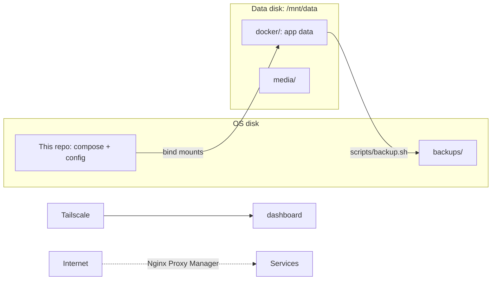

# Homelab

Docker Compose configuration and documentation for my home server: a Dell
Latitude 5521 (i7-11800H, 32 GB) running Ubuntu 24.04, with a second NVMe
for data.

## Layout

```
.
├── docker-compose.yml     main stack (media, photos, files, DNS, monitoring, ...)
├── .env.example           template for the secrets the stack needs
├── dashboard/             custom status dashboard (Node server + React client)
├── prometheus/            Prometheus scrape config
├── bots/                  build files for two trading bots (their code is in separate repos)
├── services/
│   ├── duckdns/           dynamic DNS updater
│   └── skyfactory4/       Minecraft modpack server
├── scripts/backup.sh      snapshot data + secrets to the OS disk
└── docs/                  host setup, backups, restore guide
```

## What runs

| Area | Services |
|---|---|
| Media | Jellyfin, Jellyseerr, Sonarr, Radarr, Prowlarr, qBittorrent, Lidarr, Navidrome |
| Personal cloud | Nextcloud, Immich (photos), Vaultwarden (passwords) |
| Network | Pi-hole (DNS), Nginx Proxy Manager (reverse proxy), Tailscale (host) |
| Monitoring | Prometheus, Grafana, node-exporter, Uptime Kuma, custom dashboard |
| Admin | Portainer |
| AI | Ollama, Open WebUI |
| Games | Crafty Controller, SkyFactory 4 Minecraft server |
| Bots | Trading bot, Polymarket bot |



## Setup

Secrets are never committed. Copy each `.env.example` to `.env` and fill it in:

```bash
cp .env.example .env
cp services/duckdns/.env.example services/duckdns/.env
cp services/skyfactory4/.env.example services/skyfactory4/.env
docker compose up -d --build
```

Persistent data lives in `/mnt/data/docker/`, outside the repo.

## Docs

- [Host setup](docs/host-setup.md): mount, Docker, Tailscale, boot behaviour, secrets
- [Backups](docs/backup.md): what is backed up, what is not, and the limits
- [Restore guide](docs/restore.md): rebuild order from a fresh machine

## Notes

- The main compose file references some services that are stopped on purpose
  (`lidarr`, `navidrome`). `docker compose up -d` will start them.
- This is a personal setup. Paths such as `/mnt/data` and usernames are specific to my machine.
